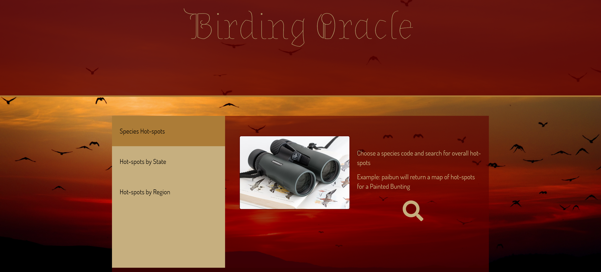

# Birding Oracle

Check it out <a href="https://bird-oracle.herokuapp.com/">here!</a>

*Where is the best place to look for painted buntings?*

*When should I put out my hummingbird feeders?*

*Where is the best place to go birding in my state?*

These are the type of questions you can expect to have answered by the Birding Oracle. 

## The Data

Data for the Birding Oracle come from <a href="https://ebird.org/home">ebird</a>, a citizen-science driven data collection project. This dataset consists of millions of records of bird sightings submitted from all over the world.

## The Code

The dashboard is an html webpage powered by JavaScript, Python & SQLite.

**Javascript libraries**

- Leaflet
- Plotly

**Python modules**

- pandas
- flask
- sqlalchemy

Now go find some birds!

